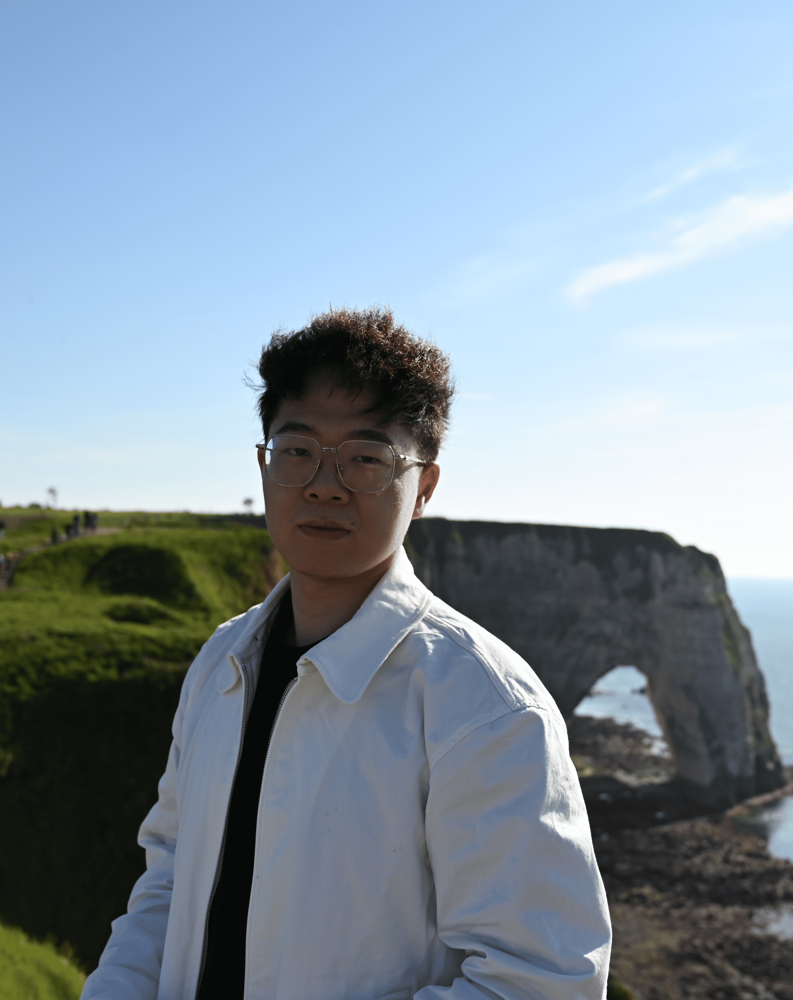

## About Me

Here is **Shifeng XIE**. 

I am a Engineer(Master) student at [Telecom Paris](https://www.telecom-paris.fr/), [Polytechnic Institute of Paris](https://www.ip-paris.fr/en). I have a keen interest in large language models (LLM), computer vision (CV), and graph neural networks (GNN). I am familiar in fundamental network models such as Transformers, Channel-Wise Attention, and UNet. Additionally, I am well-versed in various training paradigms, including contrastive learning， masked learning , joint learning ..... 

I am planning to apply for PhD positions in 2026, and I am open to opportunities worldwide!

If you are interested in any aspect of me, I am always open to discussions and collaborations. Feel free to reach out to me at - shifeng.xie@telecom-paris.fr

---

## Research Experiences

### In Context Learning
**Stellantis, France**  
*October 2024 - NOW*  

### Mixture of Experts
**Stellantis, France**  
*September 2024 – October 2024*  
- Developed two patented methods for compressing experts in a mixture-of-experts model using an autoencoder.  
- Trained 2 billion small large model with Mixture of Experts architcture.

### Graph Neural Network and Graph Representation
**Telecom Paris (Polytechnic Institute of Paris), France**  
*December 2023 – September 2024*  
- **First Author.** Paper: "Variational Graph Contrastive Learning."  
  - Accepted at NeurIPS 2024 Workshop: Self-Supervised Learning - Theory and Practice.  
  - Advisor: Jhony H. Giraldo (Assistant Professor at Télécom Paris).

### Image Processing and High Dynamic Image Reconstruction
**Xidian University, China**  
*February 2023 – September 2023*  
- **First Author.** Paper: "FTUnet: Feature Transferred U-Net for Single HDR Image Reconstruction."  
  - Accepted at ACM Multimedia Asia (MMA), Oral Presentation.  
  - Advisor: Liu Yi.

### Data Twin and Intelligent Healthcare
**Xidian University, China**  
*April 2021 – September 2021*  
- **First Author.** Paper: "Feasibility Study of Intelligent Healthcare Based on Digital Twin and Data Mining."  
  - Accepted at CISAI (International Conference on Computer Information Science and Artificial Intelligence).

---

## News and Updates

- 

